# Asus touchpad NumberPad driver

[](https://www.gnu.org/licenses/old-licenses/gpl-2.0.en.html)


[](https://github.com/asus-linux-drivers/asus-numberpad-driver/releases)
[](https://GitHub.com/asus-linux-drivers/asus-numberpad-driver/commit/)
[](https://GitHub.com/asus-linux-drivers/asus-numberpad-driver/issues?q=is%3Aissue+is%3Aclosed)
[](https://github.com/asus-linux-drivers/asus-numberpad-driver/compare)
[](https://github.com/asus-linux-drivers/asus-numberpad-driver/issues/new/choose)
[](http://makeapullrequest.com)

--
[](https://github.com/asus-linux-drivers/asus-numberpad-driver#installation)

The driver is written in python and does not necessarily run as a systemd service ([How to start NumberPad without systemd service?](#faq)). It contains the common NumberPad layouts, you can pick up the right one during the install process. Default settings aim to be the most convenient for the majority. All possible customizations can be found [here](#configuration).

If you find this project useful, please do not forget to give it a [](https://github.com/asus-linux-drivers/asus-numberpad-driver/stargazers) People already did!

[](https://ko-fi.com/ldrahnik)

## Changelog

[CHANGELOG.md](CHANGELOG.md)

## Frequently Asked Questions

[FAQ](#faq)

## Features

- Driver during installation collects anonymous data with goal improve driver (e.g. automatic layout detection; data are publicly available [here](https://lookerstudio.google.com/reporting/2bf9a72c-c675-4ff8-a3c6-2e1e8c1167b9), you can provide used config using `$ bash install_config_send_anonymous_report.sh`)
- Driver (including backlighting if hardware supported) installed for the current user
- Driver creates own virtual environment of currently installed version of `Python3`
- Multiple pre-created [NumberPad layouts](https://github.com/asus-linux-drivers/asus-numberpad-driver#layouts) with the possibility of [creating custom layouts or improving existing ones (keys, sizes, paddings..)](https://github.com/asus-linux-drivers/asus-numberpad-driver#keyboard-layout)
- Customization through 2-way sync [configuration file](https://github.com/asus-linux-drivers/asus-numberpad-driver#configuration-file) (when `$ bash ./install.sh` is run, changes previously made in the config file will not be overwritten without user permission, similarly when `$ bash ./uninstall.sh` is run the config file will be kept. In either case, when the config file or parts of it do not exist they will be automatically created or completed with default values)
- Automatic NumberPad layout detection
- Activation/deactivation of NumberPad by pressing and holding the top-right icon or another spot associated with the key `KEY_NUMLOCK` (activation time by default is 1s)
- Optional co-activator key requirement (`Shift`, `Control`, `Alt`) to prevent accidental NumberPad activation
- Fast activation/deactivation of NumberPad via slide gesture beginning at top right
- A customizable slide gesture beginning at top left can be used (by default the key `EV_KEY.KEY_CALC` is transmitted to `XF86Calculator`, so that the preferred calculator app is loaded and responds to the system
keyboard shortcuts - for example in [my toggling script](https://github.com/asus-linux-drivers/asus-numberpad-driver/blob/master/scripts/io_elementary_calculator_toggle.sh); by default is NumberPad activated if is not already and the first slide gesture activates the calculator app and the next one closes it)
- Support for field to be sent via unicode shortcut `<left_shift>+<left_ctrl>+<U>+<0-F>+<space>`
- Smooth change of backlight levels (endless loop with customizable interval, default 1s)
- Customizable default level of backlight (by default the last-used default level)
- NumberPad is automatically disabled due to inactivity (default 1 min, maximum value is around 2 minutes and is limited by hardware, more in [#143](https://github.com/asus-linux-drivers/asus-numberpad-driver/issues/143))
- NumberPad cooperation with system NumLock is configurable (activation/deactivation of NumberPad may also enable/disable system NumLock and vice versa)
- Activation of NumberPad with a configurable distance beyond which the movement of a pressed key is considered as a pointer movement rather than a key specification
- Activation of NumberPad disables pointer taps (has to be set )
- Protection against accidental multitouching (when a second finger is simultaneously used)
- Protection against sending a NumberPad key when a pointer button (left, right, middle) is clicked (configuration value set to `press_key_when_is_done_untouch=1`)
- Disabling the Touchpad (e.g. Fn+special key) disables by default the NumberPad as well (can be disabled)
- An external keyboard is recognized and automatically connected subject to appropriate [configuration](https://github.com/asus-linux-drivers/asus-numberpad-driver#external-keyboard-configuration)
- A power supply on battery mode is recognized and automatically is enabled idle functionality (after 10s and 30% brightness by default, configurable)
- Repeating a continually depressed key (disabled by default)
- Multitouch up to 5 fingers (disabled by default)

## Installation

Get the latest stable or dev version using `git` (**recommended**):

```bash
$ git clone https://github.com/asus-linux-drivers/asus-numberpad-driver
$ cd asus-numberpad-driver
# now you are using master branch with the latest changes which may be not stable
# jump to the latest release of stable version:
$ git checkout v6.8.5
```

or download the latest release (stable version) from [the release page](https://github.com/asus-linux-drivers/asus-numberpad-driver/releases), extract and install for current user and current Python3 ([How to install the driver with specific Python3 version using pyenv?](#faq)):

```bash
$ bash install.sh

# ENV VARS (with the defaults)
INSTALL_DIR_PATH="/usr/share/asus-numberpad-driver"
CONFIG_FILE_DIR_PATH="$INSTALL_DIR_PATH"
CONFIG_FILE_NAME="numberpad_dev"
LOGS_DIR_PATH="/var/log/asus-numberpad-driver" # only for install and uninstall logs
SERVICE_INSTALL_DIR_PATH="$HOME/.config/systemd/user"
INSTALL_UDEV_DIR_PATH="/usr/lib/udev"

# e.g. for BazziteOS (https://github.com/asus-linux-drivers/asus-numberpad-driver/issues/198)
$ INSTALL_DIR_PATH="/home/$USER/.local/share/asus-numberpad-driver"\
INSTALL_UDEV_DIR_PATH="/etc/udev"\
bash install.sh
```

or run separately parts of the install script.

Try found Touchpad with NumberPad:

```bash
$ bash install_device_check.sh
```

Add a user to the groups `i2c,input,uinput`:

```bash
$ bash install_user_groups.sh
```

Install a predefined rule to change the configuration when is external keyboard connected/disconnected:

```bash
$ bash install_external_keyboard_toggle.sh
```

Run driver now and every time that user logs in (do NOT run as `$ sudo`, works via `systemctl --user`):

```bash
$ bash install_service.sh
```

Activate top left corner slide gesture as function to show/disable calculator app (script supporting `io.elementary.calculator` and `gnome-calculator` via `gsettings`):

```bash
$ bash install_calc_toggle.sh
```

By installing this rule can be activated power supply saver every time when the power supply mode is changed to battery mode:

```bash
$ bash install_power_supply_saver.sh
```

or an available package on [AUR](https://aur.archlinux.org/packages?O=0&SeB=nd&K=asus-numberpad-driver&outdated=&SB=p&SO=d&PP=50&submit=Go) (maintained by @[kamack](https://github.com/kamack38)) (replace `asus-numberpad-driver` with one of the available models, e.g. `asus-numberpad-driver-ux433fa-git`)

```bash
$ paru -S asus-numberpad-driver-${model}-git
```

or for NixOS you can use flakes for the installation of this driver.

> [!IMPORTANT]
> In case the layout isn't provided, the default numpad layout is "up5401ea" make sure to change it to your layout in the configuration.

> The default value for runtimeDir is `/run/usr/1000/`, for waylandDisplay is `wayland-0` and wayland is `true`.

> Enabling `ignoreWaylandDisplayEnv` removes the explicit declaration of `WAYLAND_DISPLAY` in the service, allowing it to function correctly when switching between desktop environments or window managers that may have different `WAYLAND_DISPLAY` environment variables.

<details>
<summary>The driver installation (NixOS)</summary>
<br>

This repo contains a Flake that exposes a NixOS Module that manages and offers options for asus-numberpad-driver. To use it, add the flake as an input to your `flake.nix` file and enable the module:

```nix
# flake.nix

{

    inputs = {
        # ---Snip---
        asus-numberpad-driver = {
          url = "github:asus-linux-drivers/asus-numberpad-driver";
          inputs.nixpkgs.follows = "nixpkgs";
        };
        # ---Snip---
    }

    outputs = {nixpkgs, asus-numberpad-driver, ...} @ inputs: {
        nixosConfigurations.HOSTNAME = nixpkgs.lib.nixosSystem {
            specialArgs = { inherit inputs; };
            modules = [
                ./configuration.nix
                asus-numberpad-driver.nixosModules.default
            ];
        };
    }
}
```

Then you can enable the program in your `configuration.nix` file:

```nix
# configuration.nix

{inputs, pkgs, ...}: {
  # ---Snip---
  # Enable Asus Numpad Service
  services.asus-numberpad-driver = {
    enable = true;
    layout = "up5401ea";
    wayland = true;
    runtimeDir = "/run/user/1000/";
    waylandDisplay = "wayland-0";
    ignoreWaylandDisplayEnv = false;
    config = {
      # e.g. "activation_time" = "0.5";
      # More Configuration Options
    };
  };
  # ---Snip---
}

```

</details>

<details>
<summary>Calculator toggling set up for NixOS (home-manager)</summary>
<br>

The home manager config sets up toggling the calculator using `dconf`:

```nix
{
# Assuming gnome-calculator is installed

  # Configure custom keybinding for calculator
  dconf.settings = {
    "org/gnome/settings-daemon/plugins/media-keys" = {
      # Empty the default bindings if present
      calculator = [ "''" ];
      calculator-static = [ "''" ];

      # Set up custom keybinding
      custom-keybindings = [
        "/org/gnome/settings-daemon/plugins/media-keys/custom-keybindings/custom0/"
      ];
    };

    # Configure the custom keybinding
    "org/gnome/settings-daemon/plugins/media-keys/custom-keybindings/custom0" = {
      name = "Calculator";
      binding = "XF86Calculator";
      command = "sh -c 'if pidof gnome-calculator > /dev/null; then kill $(pidof gnome-calculator); else gnome-calculator; fi'";
    };
  };

}
```

> The key for the caclulator toggling script should be associated with XF86Calculator, allowing it to toggle any calculator application, not just the one specified in the configuration. This means that the key binding can be used to manage various calculator applications across different key binding configurations. For e.g.:

```
"XF86Calculator".action = sh -c "if pidof gnome-calculator > /dev/null; then kill $(pidof gnome-calculator); else gnome-calculator; fi";
```

</details>

## Uninstallation

To uninstall run

```bash
$ bash uninstall.sh

# ENV VARS (with the defaults)
INSTALL_DIR_PATH="/usr/share/asus-numberpad-driver"
CONFIG_FILE_DIR_PATH="$INSTALL_DIR_PATH"
CONFIG_FILE_NAME="numberpad_dev"
LOGS_DIR_PATH="/var/log/asus-numberpad-driver" # only for install and uninstall logs
SERVICE_INSTALL_DIR_PATH="$HOME/.config/systemd/user"
INSTALL_UDEV_DIR_PATH="/usr/lib/udev"

# e.g. for BazziteOS (https://github.com/asus-linux-drivers/asus-numberpad-driver/issues/198)
$ INSTALL_DIR_PATH="/home/$USER/.local/share/asus-numberpad-driver"\
INSTALL_UDEV_DIR_PATH="/etc/udev/"\
bash uninstall.sh
```

or run separately parts of the uninstall script

```bash
$ bash uninstall_calc_toggle.sh
$ bash uninstall_external_keyboard_toggle.sh
$ bash uninstall_power_supply_saver.sh
$ bash uninstall_service.sh
$ bash uninstall_user_groups.sh
```

## Layouts

The project should currently support every layout of NumberPad. Layouts below are named by laptop models, but the name is not important. What is important is their visual appearance because they are repeated on multiple laptop models across series. The install script should recognize the correct one automatically for your laptop. If yours was not recognized, please create issue.

| Model/Layout | Description                                                                                                  | Image                                                                                               |
| ------------ | ------------------------------------------------------------------------------------------------------------ | --------------------------------------------------------------------------------------------------- |
| <a id="ux433fa"></a><br><br><br><br><br>ux433fa<br><br><br><br><br><br><br> | Without % = symbols<br><br>Without left icon                                                                 | 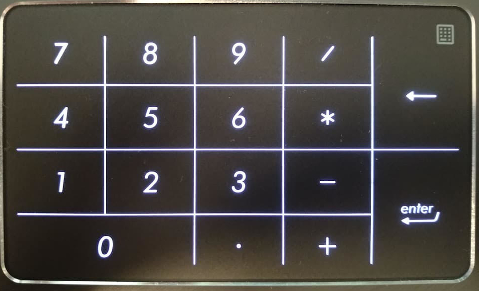                                             |
| <a id="e210ma"></a><br><br><br><br><br>e210ma<br><br><br><br><br><br><br> | With % = symbols<br><br>Without left icon                                                                    | 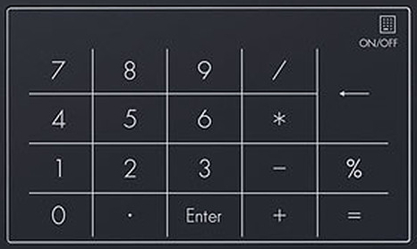                                |
| <a id="b7402"></a><br><br><br><br><br>b7402<br><br><br><br><br><br><br> | With % = symbols<br><br>Without left icon<br><br>Rectangle style of backlight                                | 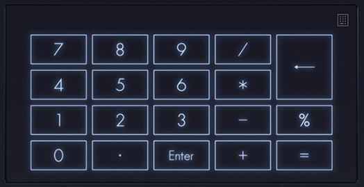 |
| <a id="up5401ea"></a><br><br><br><br><br>up5401ea<br><br><br><br><br><br><br> | With % = symbols                                                                                             | 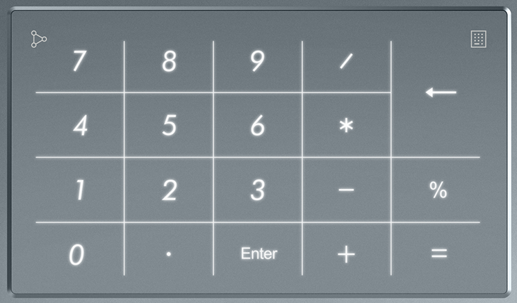 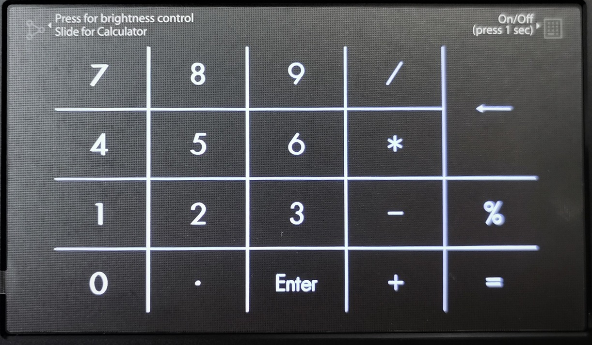                                               |
| <a id="ux581l"></a><br><br><br><br><br>ux581l<br><br><br><br><br><br><br> | With % = symbols<br><br>Vertical model                                                                       | 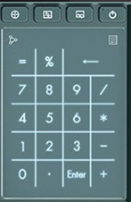                                                      |
| <a id="g533"></a><br><br><br><br><br>g533<br><br><br><br><br><br><br> | With NumLock key                                                                                             | 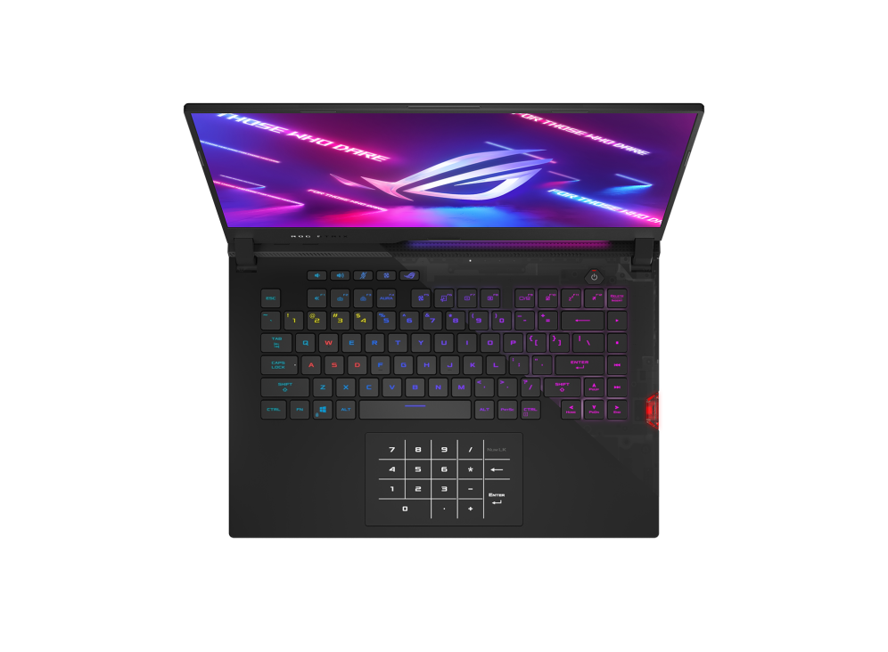 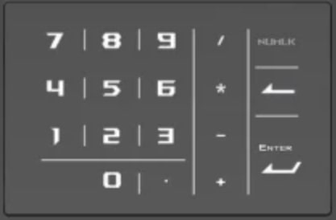                                             |
| <a id="g635"></a><br><br><br><br><br>g635<br><br><br><br><br><br><br> | | 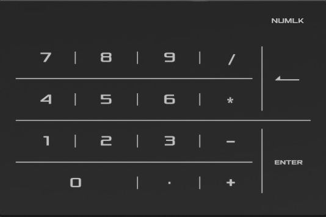                                             |
| <a id="g513"></a><br><br><br><br><br>g513<br><br><br><br><br><br><br> | With NumLock key<br><br>With left, right keys outside of NumberPad                                                                                             | 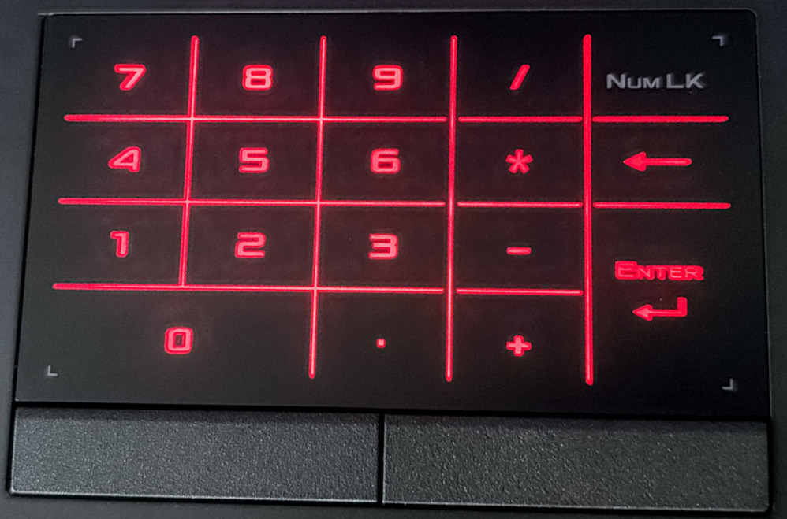                                             |
| <a id="gx701"></a><br><br><br><br><br>gx701<br><br><br><br><br><br><br> | With # symbol<br><br>With NumLock key outside of touchpad<br><br>With left, right keys outside of NumberPad   |                                               |
| <a id="gx551"></a><br><br><br><br><br>gx551<br><br><br><br><br><br><br> | Without % = symbols<br><br>With NumLock key on the top left<br><br>With left, right keys outside of NumberPad | 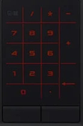                                                               |

### Dependencies

**Everything is included in the install scripts**

To see the exact commands for the package manager look [here](./install.sh) (for python dependencies take a look at [requirements.txt](./requirements.txt))

## Troubleshooting

- The install and uninstall logs are here `/var/log/asus-numberpad-driver/*.log`. The runtime logs can be found using `journalctl -f | grep asus-numberpad-driver` or `journalctl -f --user-unit asus_numberpad_driver@$USER.service`.

- **The start point [x:0,y:0] of touchpad is at the left top!**
- **Before debugging make sure you have disabled the asus_numberpad_driver@.service**

```bash
$ systemctl stop --user asus_numberpad_driver@<$USER>.service
```

- To show debug logs run the following command in a terminal (**Do not forget to specify the numpad layout and the config file path**):

```bash
# Debugging installed driver:
#
# $ G_MESSAGES_DEBUG=all LOG=DEBUG /usr/share/asus-numberpad-driver/.env/bin/python3 ./numberpad.py <REQUIRED:numpad layout file name without extension .py> <OPTIONAL:directory where is located config file with name: numberpad_dev, by default is taken CWD - current working directory, if inexistent the config file is created and filled with default values>
#
# Or downloaded (uninstalled yet) driver:
#
# $ virtualenv --python=$(python3 --version | cut -d" " -f2) .env
# $ source .env/bin/activate
# $ pip3 install -r requirements.txt
# $ $ G_MESSAGES_DEBUG=all LOG=DEBUG .env/bin/python3 ./numberpad.py
# $ deactivate


cd asus-numberpad-driver
G_MESSAGES_DEBUG=all LOG=DEBUG ./numberpad.py "up5401ea" "" # now driver use root of repository as directory for config file named numberpad_dev which if does not exist will be autocreated with default values

cd asus-numberpad-driver
G_MESSAGES_DEBUG=all LOG=DEBUG ./numberpad.py "up5401ea" "/usr/share/asus-numberpad-driver/" # now driver use installed config
```

- To show pressed keys:

```
sudo apt install libinput-tools
sudo libinput debug-events
```

- To simulate key press:

```
sudo apt install xdotool
xdotool key XF86Calculator
```

### FAQ ###

**How to start NumberPad without systemd service?**

- install in standard way using `bash install.sh` and answer no to the question about using `systemd`
- layout name is required as first argument and as second argument can be optionally passed path to directory where will be autocreated config `numberpad_dev` (default is current working directory):

```
/usr/share/asus-numberpad-driver/.env/bin/python3 /usr/share/asus-numberpad-driver/numberpad.py <up5401ea|e210ma|..>
```

**How to install the driver when is used pyenv for managing multiple Python versions?**

```
$ git clone https://github.com/asus-linux-drivers/asus-numberpad-driver
$ cd asus-numberpad-driver

$ # pyenv install Ubuntu 22.04
$ apt install -y make build-essential libssl-dev zlib1g-dev libbz2-dev libreadline-dev libsqlite3-dev wget curl llvm libncurses5-dev libncursesw5-dev xz-utils tk-dev libffi-dev liblzma-dev python3-openssl git
$ curl https://pyenv.run | bash

# install & change to the Python version for which one do you want to install the driver
$ CC=clang pyenv install 3.9.4
$ pyenv global 3.9.4 # change as global
$ # pyenv local 3.9.4 # will create file .python-version inside source dir so next (re)install will be used automatically saved Python version in this file

# install the driver
$ bash install.sh

# change to the standardly (previously) used Python version
$ pyenv global system
```

**How can NumberPad be activated via CLI?**

- if `sys_numlock_enables_numpad = 1` is set in the config file (enabled by default), then NumberPad will be activated/disabled according to the status of system NumLock, source of the system numlock signal can be physical numlock key on the same laptop or external keyboard or simulated key via `xdotool key Num_Lock` or `numlockx on` and `numlockx off`

- directly just change `enabled` in the appropriate lines of the config file:

```
# enabling NumberPad via command line
sed -i "s/enabled = 0/enabled = 1/g" numberpad_dev
sed -i "s/enabled = 0/enabled = 1/g" /usr/share/asus-numberpad-driver/numberpad_dev
# disabling
sed -i "s/enabled = 1/enabled = 0/g" numberpad_dev
sed -i "s/enabled = 1/enabled = 0/g" /usr/share/asus-numberpad-driver/numberpad_dev
```

**Is any key of NumberPad not sent properly?**

```
$ sudo evtest
No device specified, trying to scan all of /dev/input/event*
Available devices:
...
/dev/input/event12:	ASUE140D:00 04F3:31B9 Touchpad
/dev/input/event13:	ASUE140D:00 04F3:31B9 Keyboard
...
/dev/input/event22:	Asus Touchpad/Numpad
Select the device event number [0-22]: 22
Input driver version is 1.0.1
Input device ID: bus 0x0 vendor 0x0 product 0x0 version 0x0
Input device name: "Asus Touchpad/Numpad"
Supported events:
  Event type 0 (EV_SYN)
  Event type 1 (EV_KEY)
    Event code 14 (KEY_BACKSPACE)
    Event code 18 (KEY_E)
    Event code 22 (KEY_U)
    Event code 29 (KEY_LEFTCTRL)
    Event code 30 (KEY_A)
    Event code 31 (KEY_S)
    Event code 32 (KEY_D)
    Event code 33 (KEY_F)
    Event code 42 (KEY_LEFTSHIFT)
    Event code 46 (KEY_C)
    Event code 48 (KEY_B)
    Event code 55 (KEY_KPASTERISK)
    Event code 57 (KEY_SPACE)
    Event code 69 (KEY_NUMLOCK)
    Event code 71 (KEY_KP7)
    Event code 72 (KEY_KP8)
    Event code 73 (KEY_KP9)
    Event code 74 (KEY_KPMINUS)
    Event code 75 (KEY_KP4)
    Event code 76 (KEY_KP5)
    Event code 77 (KEY_KP6)
    Event code 78 (KEY_KPPLUS)
    Event code 79 (KEY_KP1)
    Event code 80 (KEY_KP2)
    Event code 81 (KEY_KP3)
    Event code 82 (KEY_KP0)
    Event code 83 (KEY_KPDOT)
    Event code 96 (KEY_KPENTER)
    Event code 98 (KEY_KPSLASH)
    Event code 117 (KEY_KPEQUAL)
    Event code 140 (KEY_CALC)
    Event code 272 (BTN_LEFT)
    Event code 273 (BTN_RIGHT)
    Event code 274 (BTN_MIDDLE)
Properties:
Testing ... (interrupt to exit)
Event: time 1679133719.799252, type 1 (EV_KEY), code 140 (KEY_CALC), value 1
Event: time 1679133719.799252, -------------- SYN_REPORT ------------
Event: time 1679133719.799295, type 1 (EV_KEY), code 140 (KEY_CALC), value 0
Event: time 1679133719.799295, -------------- SYN_REPORT ------------
```

**Toggling calculator app does not work**

- When new keybindings are added to list `custom-keybindings`, it is necessary to log out. Otherwise the newly added shortcut will not work.

- When using custom keybinding via `custom-keybindings` values `calculator` and `calculator-static` have to be empty:

```
$ sudo install dconf-editor
$ gsettings set org.gnome.settings-daemon.plugins.media-keys calculator [\'\']
$ gsettings set org.gnome.settings-daemon.plugins.media-keys calculator-static [\'\']
```
- Whether the script works can be tested via `bash /usr/share/asus-numberpad-driver/scripts/calculator_toggle.sh`

- Whether keybinding works can be tested via a slide gesture on NumberPad or by simulating the `XF86Calculator` key with `xdotool key XF86Calculator`


**Dconf permissions problem**

When the driver is installed under the current user and this error occurs:

```
(process:393177): dconf-CRITICAL **: 14:12:44.964: unable to create file '/run/user/1000/dconf/user': Permission denied.  dconf will not work properly.
```

fix it by changing the owner and group to the current user from


```
ldrahnik@Zenbook-UP5401EA:/run/user/1000/dconf$ ls -la
total 4
drwx------  2 ldrahnik ldrahnik  60 Jun  3 21:57 .
drwx------ 16 ldrahnik ldrahnik 520 Jun  4 14:04 ..
-rw-------  1 root     root       2 Jun  3 22:52 user
```

to

```
ldrahnik@Zenbook-UP5401EA:/run/user/1000/dconf$ ls -la
total 4
drwx------  2 ldrahnik ldrahnik  60 Jun  3 21:57 .
drwx------ 16 ldrahnik ldrahnik 520 Jun  4 14:04 ..
-rw-------  1 ldrahnik ldrahnik   2 Jun  4 14:14 user
```

using these commands:

```
# owner
sudo chown ldrahnik user
# group
sudo chown :ldrahnik user
```

**Invalid MIT-MAGIC-COOKIE-1 key**

When this happens on X11, try simply removing the currently used `.Xauthority` discovered via the `xauth` command and then rebooting to autocreate the file:

```
$ xauth
Using authority file /home/ldrahnik/.Xauthority
xauth>^C
$ rm /home/ldrahnik/.Xauthority
$ reboot
```

**Backlight was not activated**

Below with **<device_id>** I mean i2c device which can be found by running the script from repository `$ bash install_device_check.sh`, **<device_addr>** is usually `0x15` except for devices `ASUF1416, ASUF1205, ASUF1204` is value `0x38`. Execute the command below (you have to change only the previous last hex value `<0x01>` with other possible values like is described below under the command):

```
$ i2ctransfer -f -y <device_id> w13@<device_addr> 0x05 0x00 0x3d 0x03 0x06 0x00 0x07 0x00 0x0d 0x14 0x03 <0x01> 0xad
```

Just manually try these values below as replacements for `<0x01>` but keep in mind that first has to be NumberPad activated and then you can try to change the level of brightness:


- `0x01` should activate the backlight of NumberPad
- `0x60` should activate the backlight of NumberPad

- change brightness levels

```
0x41-0x48

# below might change brightness level in special cases
"0x2f",
"0x2e",
"0x2d",
"0x2c",
"0x2b",
"0x2a",
"0x29",
"0x28",
"0x27",
"0x26",
"0x25",
"0x24",
"0x23",
"0x22",
"0x21",
"0x20"
```

- `0x00` should deactivate the backlight of NumberPad
- `0x61` should deactivate the backlight of NumberPad


**Read environment variables for systemctl service**

```
$ systemctl status <name>.service # read PID
$ sudo strings /proc/<PID>/environ
```

## Configuration

### Keyboard layout

During the install process `bash ./install.sh`, you're required to select your keyboard layout:

```
...
1) b7402.py
2) e210ma.py
3) g533.py
4) gx551.py
5) gx701.py
6) up5401ea.py
7) ux433fa.py
8) ux581l.py
9) Quit
Please enter your choice
...
```

Each key layout (`g533.py`, `gx701.py`, ..) chosen during the install process corresponds to a specific file. To change any layout depending settings you need to locally edit the selected layout file and change the value of the corresponding variable from the first table below.

Example: If you want to set the size of top right icon to bigger and you have chosen the layout `up5401ea.py` during the install process. You need to change the corresponding variables (`top_right_icon_width = 400`,`top_right_icon_height = 400`) in the layout file (`asus-numberpad-driver/layouts/up5401ea.py`) and install the layout again.

| Option                                        | Required | Default           | Description |
| --------------------------------------------- | -------- | ----------------- | ----------------------------------------------------------------------------------------------------------------------------------------------------------------------------------------------------------------------------------------------------------------------------------------------------------------------------------------------------------------------------------------------------------------------------------------------------------------------------------------------------------------------------------------------------------------------------------------------------------------------------------------------------------------------------------------------------------------------------------------------------------------- |
| **Key layout**                                |          |
| `keys`                                        | Required |                   | map of keys as array of arrays, dimension has to be at least array of lenght 1 inside array<br><br>everything else that is not an event (e.g. `EV_KEY.KEY_KP7`) or array of events (are sent together! e.g. `[EV_KEY.KEY_LEFTSHIFT, EV_KEY.KEY_KP5]]`) except `None` is sent as a unicode character `<left_shift>+<left_ctrl>+<U>+<0-F>` (use apostrophes!, e.g. `"%"` in layouts `up5401ea, ux581l` or `"#"` in layout `gx701`. It is also allowed to also use string of unicode characters e.g. `"±%"`)
| `keys_ignore_offset`                          |          | `[]`              | map of keys which should be touchable even in an offset area<br><br>e.g. used in layout `gx551` with value `[0,0]` where is NumLock key on the top left and right icon as primary activation area for NumLock is not used
**Top left icon**                             |          |                   | these functions are disabled when the option `top_left_icon_height` or `top_left_icon_width` is missing and the icon has to be touchable (`0` dimensions) |
| `top_left_icon_width`                         |          |                   | width of the top left icon
| `top_left_icon_height`                        |          |                   | height of the top left icon
| `top_left_icon_slide_func_keys`               |          | `[EV_KEY.KEY_CALC]` | array of `InputEvent`
| **Top right icon**                            |          |                   | send `numlock` key and activate/deactivate NumberPad<br><br>activation/deactivation touch has to start over the icon area declared by `top_right_icon_width` and `top_right_icon_height`
| `top_right_icon_width`                        |          |                   | width of the top right icon
| `top_right_icon_height`                       |          |                   | height of the top right icon
 **Paddings**                                   |          |                   | NumberPad has padding zones around it where nothing happens when is touched except for top icons
| `top_offset`                                  |          | `0` (px)            | top NumberPad offset
| `right_offset`                                |          | `0` (px)            | right NumberPad offset
| `left_offset`                                 |          | `0` (px)            | left NumberPad offset
| `bottom_offset`                               |          | `0` (px)            | bottom NumberPad offset
| **Backlight**                                 |          |                   |
| `backlight_levels`                            |          |                   | array of backlight levels in hex format `0x00` for brightness change by `top_left_icon` (values for turn on (`0x01`) and turn off (`0x00`) are hard-coded)

### Keyboard layout co-activator keys

To prevent accidental NumberPad activation while using the touchpad, you can configure a co-activator key. This requires holding a modifier key like `Alt` while touching the `Num_Lock` area to activate the NumberPad.

During installation, you will be prompted to select a co-activator key:

```
Select co-activator key:
1) None
2) Shift
3) Control
4) Alt
6) Quit
```

The co-activator is configured by modifying the `keys` array in your layout file. When a co-activator is set, the `Num_Lock` entry becomes an array:

```python
# without co-activator (default):
keys = [
    ["Num_Lock", "slash", "asterisk", "minus"],
    ...
]

# with Alt as co-activator:
keys = [
    [["Num_Lock", "Alt"], "slash", "asterisk", "minus"],
    ...
]
```

Also the co-activator is configured by modifying the `top_right_icon_coactivator_key` in your config file. When a co-activator is set, the `top_right_icon_coactivator_key` value becomes:

```
...
top_right_icon_coactivator_key = Alt
```

Config value applies on slide gestures from the top left or top right icon or by touching the top right icon that IS NOT part of the grid.

You can also manually edit your layout file (`/usr/share/asus-numberpad-driver/layouts/<layout-name>.py`) to add or change the co-activator key after installation.


### Configuration file

Attributes which do not depend on a specific Numpad keyboard can be changed according to the table below in the config `numberpad_dev` in the installed driver location `/usr/share/asus-numberpad-driver`. See the example below showing the default attibutes:

```
[main]
numpad_disables_sys_numlock = 1
disable_due_inactivity_time = 120
touchpad_disables_numpad = 1
key_repetitions = 0
multitouch = 0
one_touch_key_rotation = 0
activation_time = 1
sys_numlock_enables_numpad = 1
top_left_icon_activation_time = 1
top_left_icon_slide_func_activation_radius = 1200
top_left_icon_slide_func_activates_numpad = 1
top_left_icon_brightness_func_max_min_only = 1
top_right_icon_slide_func_activation_radius = 1200
enabled_touchpad_pointer = 3
press_key_when_is_done_untouch = 1
enabled = 0
default_backlight_level = 0x01
top_left_icon_brightness_func_disabled = 0
brightness = 0x41
distance_to_move_only_pointer = 250
idled = 0
idle_brightness = 30
idle_time = 30
idle_enabled = 0
top_left_icon_slide_func_disabled = 0
top_right_icon_coactivator_key = Shift
```

| Option                                        | Required | Default           | Description |
| --------------------------------------------- | -------- | ----------------- | ----------------------------------------------------------------------------------------------------------------------------------------------------------------------------------------------------------------------------------------------------------------------------------------------------------------------------------------------------------------------------------------------------------------------------------------------------------------------------------------------------------------------------------------------------------------------------------------------------------------------------------------------------------------------------------------------------------------------------------------------------------------- |
| **System**                                    |          |                   |
| `enabled`                                     |          | `0`               | NumberPad running status (enabled/disabled)
| `disable_due_inactivity_time`                 |          | `120` [s]            | NumberPad is automatically disabled when no event received during this interval<br><br>decimal numbers allowed (e.g. `60.0` [s] is one minute, `0` set up disables this functionality)
| `touchpad_disables_numpad`                    |          | `1`            | when Touchpad is disabled is NumberPad is disabled aswell, valid value is `1` or `0` (e.g. via Fn+special key)<br><br>status is being attempted for the first time from `gsettings get org.gnome.desktop.peripherals.touchpad send-events` or using `qdbus` (more in code), can be tested via direct change `gsettings set org.gnome.desktop.peripherals.touchpad send-events 'enabled'` or simulation of Touchpad toggling via CLI `xdotool key XF86TouchpadToggle` or `xdotool key XF86TouchpadOn` and `xdotool key XF86TouchpadOff`, secondly the result of `xinput` is taken - in this case [this script](https://github.com/ldrahnik/elementary-os-scripts/blob/master/toggle_touchpad.sh) which has to be bound to a specific Touchpad key
| `sys_numlock_enables_numpad`                  |          | `1`           | NumLock status obtained via active `LED_NUML` of keyboard device (by default NumberPad is enabled or disabled when the system NumLock is toggled)<br><br>System NumLock can be simulated `xdotool key Num_Lock`<br><br>`sys_numlock_enables_numpad` to be set to `1` automatically even when is in config file value is `0` (overwritten) in cases when no position key `EV_KEY.KEY_NUMLOCK` has been defined in the key layout and top right icon is not defined (size values `top_right_icon_width` and `top_right_icon_height`)
| `numpad_disables_sys_numlock`                  |          | `1`           | when is set to `1` at each inactivation of NumberPad `EV_KEY.KEY_NUMLOCK` is sent. This is useful to not send NumLock when a laptop is connected to an external keyboard and one wants to disable NumberPad on laptop keeping NumLock on the external keyboard enabled
| `enabled_touchpad_pointer`                  |          | `3`           | valid values are `0`, `1`, `2`, `3` <br><br>when set to `1` the touchpad pointer can be used for moving and for clicking the left, right and middle pointer buttons when NumberPad is activated, `0` disables this usage and `2` allowes only pointer button clicks, `3` allowes only touchpad pointer movements without clicks (touchpad tap-to-click is disabled/enabled using `gsettings` on `gnome`, `qdbus` on `kde` and using `xinput` for `X11` with this order priority)
| `press_key_when_is_done_untouch`                  |          | `1`           | valid values are `0`, `1` <br><br>when set to `1` the touchpad sends keys when the finger is released (e.g. allows moving with the pointer and allows canceling sending when is the finger before untouch moved outside of the grid spot for touched character or moved inside the grid spot more than is defined by `distance_to_move_only_pointer`)
| **Key layout**                                |          |
| `activation_time`              |          | `1.0` [seconds]             | amount of time you have to hold `top_right_icon` or another predefined key `EV_KEY.KEY_NUMLOCK` for NumberPad activation/deactivation<br><br>decimal numbers allowed
| `multitouch`                                  |          | `0`           | up to quint tap when enabled<br><br>Example 1: can be enabled when two fingers somewhere on the Touchpad while using NumberPad for calculating;
| `one_touch_key_rotation`                      |          | `0`           | possibility of sending multiple keys during one-touch
| `key_repetitions`                             |          | `0`           | when set to `1` and key is held, the associated character is repeatedly sent until the key is released
| `distance_to_move_only_pointer`                             |          | `0` [px]           | when `press_key_when_is_done_untouch = 1` (by default) and `one_touch_key_rotation = 0` (by default) and finger crossed the line separating from bordering key, a reset of current key is implemented so that will not be printed<br><br>this option allows specify the same behaviour but inside key area with distance in px crossed to another key and is set up to enable with value `1` hold key for repeated pressing key like on a physical keyboard
| **Top left icon**                             |          |                   | a customized function called when NumberPad activated and the `top_left_icon` is touched and the finger is slided towards the center and removed, moving by atleast as far as specified by the designed ratios of touchpad width > `top_left_icon_slide_func_activation_x_ratio` and height > `top_left_icon_slide_func_activation_y_ratio` and the array `top_left_icon_slide_func_keys` is not empty<br><br>e.g. when NumberPad is activated, `top_left_icon_brightness_function_disabled` is not `1`, array `backlight_levels` is not empty, the brightness function works in an endless loop of incrementing brightness in the interval `top_left_icon_activation_time`
| `top_left_icon_activation_time`               |          | `1.0` [s]             | amount of time for touch `top_left_icon`<br><br>decimal numbers allowed
| `top_left_icon_slide_func_activates_numpad`   |          | `1`             |  valid value is `0` or `1`, whether is NumberPad activated if is not already
| `top_left_icon_slide_func_activation_radius` |          | `1200` [px]         | minimum radius of slide
| `top_left_icon_brightness_func_disabled`      |          | `0`            | valid value is `0` or `1`, allow forced disablement of brightness change function<br><br>brightness function is auto disabled when array `backlight_levels` is empty and when `top_left_icon_width` or `top_left_icon_width` is not set
| `top_left_icon_brightness_func_max_min_only`  |          | `0`            | valid value is `0` or `1`
| `top_left_icon_slide_func_disabled`           |          | `0`            | valid value is `0`, `1`, `2`, `3`<br><br>`0` - func is not disabled<br><br>`1` - func is disabled at all<br><br>`2` - func is disabled only when NumberPad is not activated<br><br>`3` - func is disabled only when NumberPad is activated
| **Top right icon**                            |          |                   | send `numlock` key and activate/deactivate NumberPad<br><br>activating/deactivating touch has to start over icon area declared by `top_right_icon_width` and `top_right_icon_height` for amout of time in `activation_time` or NumberPad is activated/deactivated with slide function from this icon to center and removed, moving atleast as far as specified by the ratios of touchpad width > `top_right_icon_slide_func_activation_radius` and height > `top_right_icon_slide_func_activation_radius` |
| `top_right_icon_slide_func_activation_radius`|          | `1200` [px]         | minimum radius of slide
| `top_right_icon_coactivator_key`                     |          | ``            | empty default means no co-activator keys are required (valid values are `Shift`, `Control` or `Alt` delimeted by space)<br><br>this works only for activation using slide gestures from the top left or top right icon or by touching the top right icon that IS NOT part of the grid (when the top right icon is part of grid, the co-activator must be configured inside layout keys - as described under the heading Keyboard layout co-activator keys)
**Backlight**                                   |          |                   |
| `default_backlight_level`                     |          | `0x01`            | default backlight level in hex format `0x00` (must be the value from layout `backlight_levels` or value for disabled brightness `0x00` or value for usage of last used brightness `0x01`)
**Idle**                                   |          |                   |
| `idled`                     |          | `0`            | state whether is NumberPad idled (not disabled but decreased brightness)
| `idled_brightness`                     |          | `30` [%]            |  in percents decreased brightness in idle
| `idle_time`                     |          | `10` [s]            |  after how many seconds of NumberPad inactivity will be triggered idle state
| `idle_enabled`                     |          | `0`            |   whether is idle functionality enabled (use optionally installed `udev` rule which detects change of power supply mode to battery and enables idle functionality)

### External keyboard configuration

Also installed is `udev` rule `90-numberpad-external-keyboard` which runs `.sh` scripts for NumberPad configuration change when an external keyboard is connected or disconnected.

To specify that an external keyboard is connected or add an external keyboard requires these changes:

```
sys_numlock_enables_numpad=0
numpad_disables_sys_numlock=0
```

To specify having no external keyboard or to remove an external keyboard requires these changes:

```
sys_numlock_enables_numpad=1
numpad_disables_sys_numlock=1
```

## Credits

Thank you very much all the contributors of [asus-numberpad-driver](https://github.com/mohamed-badaoui/asus-touchpad-numpad-driver) for your work.

Thank you who-t for great post about multitouch [Understanding evdev](http://who-t.blogspot.com/2016/09/understanding-evdev.html).


## Similar existing

- [python service, first initialization] <https://gitlab.com/Thraen/gx735_touchpad_numpad>
- [python service] <https://github.com/danahynes/Asus_L410M_Numpad> inspired by [python service, first initialization] <https://gitlab.com/Thraen/gx735_touchpad_numpad>
- [python service, configurable, the most widely used repository] <https://github.com/mohamed-badaoui/asus-touchpad-numpad-driver> inspired by [python service] <https://gitlab.com/Thraen/gx735_touchpad_numpad>
- [c++ and meson] <https://github.com/xytovl/asus-numpad> inspired by/rewritten version of [python service, configurable, the most widely used repository] <https://github.com/mohamed-badaoui/asus-touchpad-numpad-driver>
- [rust] <https://github.com/iamkroot/asus-numpad> rewritten in rust the same python project which was starting point for this repository  <https://github.com/mohamed-badaoui/asus-touchpad-numpad-driver>
- [python service, configurable, the most up-to-date] **The above project with continuing work based on** [python service, configurable, the most spread repository] <https://github.com/mohamed-badaoui/asus-touchpad-numpad-driver>
- [c++] <https://github.com/haronaut/asus_numberpad>
- [c] <https://github.com/valoran-M/asus_driver_touchpad>
- [c++] <https://github.com/Stivux/asus_numpad>
- [c] <https://github.com/chovine/asus_numpad_overlay>

## Existing related projects

- [WIP, package for arch based open rc systems] <https://codeberg.org/BenWestcott/asus-numpad-driver-openrc> prepared driver PKGBUILD and other infrastructure needed for Arch-based OpenRC systems

## Existing related articles

- [Numpad linux driver — implementation of multitouch] <https://medium.com/@ldrahnik/numpad-linux-driver-implementation-of-multitouch-bd8ae76a8d6c>

**Why have been these projects initiated?** Because linux does not support integration of NumberPad into a Touchpad ([see the reported issue for Ubuntu](https://bugs.launchpad.net/ubuntu/+source/linux/+bug/1810183))

**Why was this project created?** Because the above mentioned lack needed features, contain unfixed bugs and are not regularly updated

**Stargazer evolution for the project**

[](https://starchart.cc/asus-linux-drivers/asus-numberpad-driver)

**Buy me a coffee**

Do you think my effort put into open source is useful for you / others? Please put a star in the GitHub repository. Every star makes me proud. Any contribution is also welcome. Would you like to reward me more? There now exists a way : you can invite me for a coffee! I would really appreciate that!

For this [ko-fi.com/ldrahnik](https://ko-fi.com/ldrahnik) is preferred instead of [buymeacoffee.com/ldrahnik](https://buymeacoffee.com/ldrahnik) because of zero commissions.

[](https://ko-fi.com/ldrahnik)

[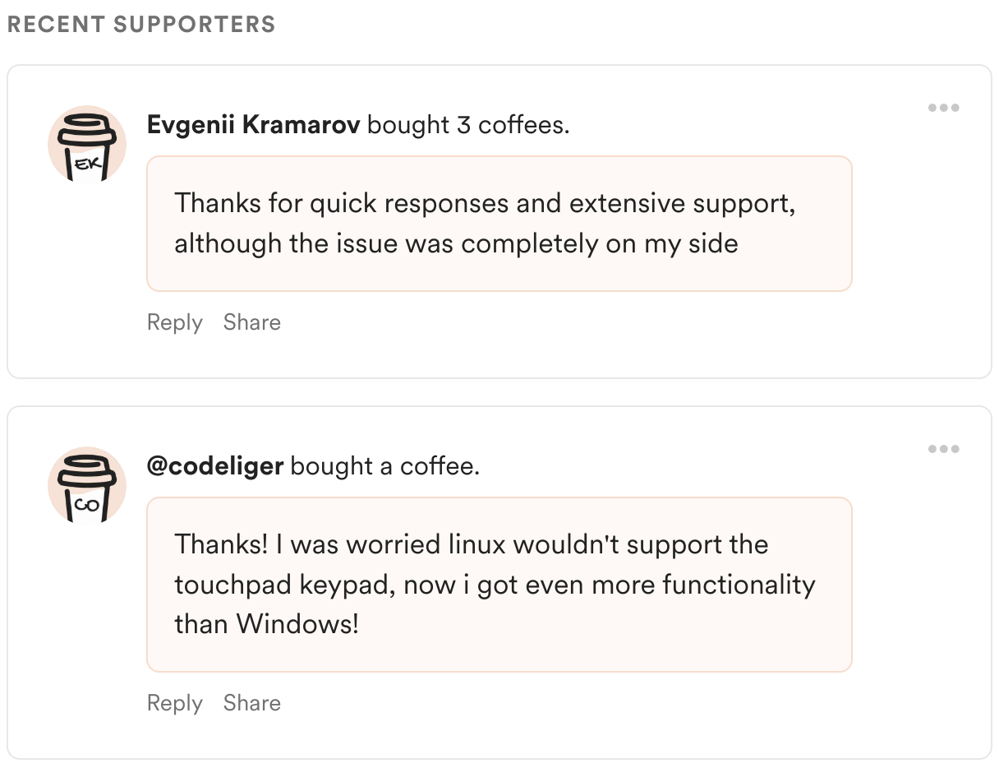](https://buymeacoffee.com/ldrahnik)
